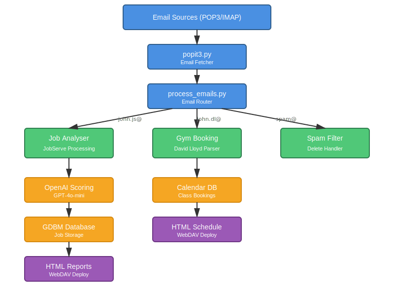

# PopIt3 - Intelligent Email Processing Pipeline

A modular email processing system that routes incoming emails to specialized handlers based on recipient address. Currently supports automated job application analysis with AI-powered CV matching, fitness class schedule management, and intelligent spam filtering.

##  Live Reports

See the system in action:

- **Job Analysis Report**: [https://www.critchley.biz/JobAnalysis](https://www.critchley.biz/JobAnalysis)
Click on the score to get the AI reasoning
- **David Lloyd Schedule**: [https://www.critchley.biz/DavidLloyd/timetable.html](https://www.critchley.biz/DavidLloyd/timetable.html)
Derived from parsing the booking emails - no AI involved

Reports are updated automatically via cron.

##  Architecture Overview



##  Core Functionality

### Email Routing System
The system routes emails to specialized processors based on the `To:` address:

| Recipient Address | Processor | Function |
|------------------|-----------|----------|
| `john.dl@critchley.biz` | Gym Booking | Extracts David Lloyd class bookings, maintains calendar |
| `john.js@critchley.biz` | Job Analyser | Analyses JobServe alerts against CV using OpenAI |
| Spam addresses | Spam Filter | Deletes known spam recipients |
| Other addresses | Mail Router | Routes to appropriate mailspool |

### 1. Job Analysis Processor 

**Purpose**: Automatically scores job opportunities against your CV using AI

**Pipeline**:
1. Receives JobServe job alert emails
2. Extracts job details (title, description, salary, location, skills)
3. Sends to OpenAI API with CV context for scoring (0-10)
4. Stores results in GDBM database (keyed by Message-ID)
5. Generates HTML reports with color-coded matches
6. Deploys reports to WebDAV server

**Key Features**:
- Duplicate detection using Message-ID
- AI-powered CV-job matching
- Structured scoring with explanations
- Web-deployed visual reports
- Historical job tracking

##  Database Schema

### Main Jobs Database: `~/.jobserve.gdbm`

Each job record is keyed by Message-ID and contains:

**Classified Job Records** (job_type: "alert" or "suggestion"):
```json
{
  "subject": "Job Title from email",
  "date": "2026-01-22T12:30:00+00:00",
  "job_type": "alert",
  "parsed_job": {
    "job_title": "Senior Engineer",
    "company": "Acme Inc",
    "location": "London",
    "salary": "£80-100k",
    "description": "Full job description HTML",
    "job_url": "https://...",
    "ref": "JS-12345"
  },
  "scored_job": "{\"score\": 7, \"reason\": \"...detailed analysis...\"}",
  "score": 7,
  "score_reason": "...detailed reasoning..."
}
```

**Application Records** (job_type: "application"):
```json
{
  "subject": "JobServe Job Application Confirmation",
  "date": "2026-01-22T14:00:00+00:00",
  "job_type": "application",
  "parsed_application": {"application_id": "...", "job_title": "..."}
}
```

**Unclassified Email Records** (no job_type match):
```json
{
  "subject": "Unmatched email subject",
  "date": "2026-01-22T10:00:00+00:00",
  "unclassified": {}
}
```

### Email Classification Logic

Classification happens in `newparser_jobserve.py::classify_job()`:

| Pattern | Type | Handling | Cleanup |
|---------|------|----------|---------|
| "job suggestion" | suggestion | AI scored, included in jobs table | 14 days |
| "job alert" | alert | AI scored, included in jobs table | 14 days |
| "Application Confirmation" | application | Stored with parsed data | 28 days |
| Other emails | unclassified | Stored as-is with flag | No auto-delete |

### Report Generation

`job_analysis_report.py` generates HTML with three tables:

1. **Scored Jobs Table** - All classified jobs with scores (filtered: excludes applications & unclassified)
2. **Job Applications Table** - Your application confirmations (DateTime, Subject)
3. **Unclassified Emails Table** - Emails that didn't match patterns (DateTime, Subject)

Auto-cleanup:
- Jobs older than 14 days: Deleted from database and email marked for deletion
- Applications older than 28 days: Deleted from database and email marked for deletion
- Unclassified emails: No automatic deletion


**Technologies**: OpenAI GPT-4o-mini, GDBM, HTML generation, WebDAV

### 2. Gym Booking Processor 

**Purpose**: Maintains calendar of fitness class bookings

**Pipeline**:
1. Receives David Lloyd booking confirmation emails
2. Parses class details (name, time, instructor, location)
3. Updates calendar database
4. Generates ICS calendar entries (future enhancement)

**Technologies**: HTML parsing, GDBM storage

### 3. Spam Filter Processor 

**Purpose**: Automatically deletes emails to known spam addresses

**Pipeline**:
1. Identifies emails to spam-designated addresses
2. Logs deletion
3. Removes from mail server

### 4. Mail Router 

**Purpose**: Routes other emails to appropriate mailspools

**Pipeline**:
1. Determines destination based on routing rules
2. Archives to local or WebDAV maildir
3. Maintains message integrity

##  Development & Contributing

### Git Workflow

This project uses a feature branch strategy to keep `main` stable:

- **`main` branch**: Production-ready code. Safe fallback point. Merged only when fully tested.
- **`dev` branch**: Main development branch. Receives frequent commits as features are developed.
- **Feature branches**: Created from `dev` for specific features/fixes.

**Workflow**:
1. Create feature branch from `dev`: `git checkout -b feature/my-feature dev`
2. Commit frequently to track progress
3. Test thoroughly (not just "it runs" - validate results are correct)
4. When ready, merge to `main` with squashed commits: `git merge --squash feature/my-feature`
5. This keeps `main` clean with meaningful commit history while preserving detailed history on `dev`

**Safety**: If `dev` gets messy, you can always revert to the last known-good state on `main`.

### Testing

Key things to test when making changes:

1. **Email Processing**: Run `popit3.py --reprocess` and verify scores are generated correctly
2. **Report Generation**: Run `job_analysis_report.py --no-deploy` and check HTML output
3. **Database Integrity**: Verify records in `~/.jobserve.gdbm` match expectations
4. **Classification**: Ensure application confirmations and unclassified emails are properly separated
5. **Cleanup**: Verify old records are deleted according to age thresholds


### Prerequisites

- Python 3.8+
- OpenAI API key (for job analysis)
- Email account with POP3 access
- WebDAV server (optional, for report deployment)

### Installation

```bash
# Clone repository
git clone https://github.com/john-critchley/popit3.git
cd popit3

# Install dependencies
pip install -r requirements.txt

# Configure credentials
cp .netrc.example ~/.netrc
chmod 600 ~/.netrc
# Edit ~/.netrc with your email and WebDAV credentials

# Set up OpenAI API key
python3 -c "import gdata; db = gdata.gdata('~/.env_data'); db['api_key'] = 'your-openai-key'; db.close()"
```

### Basic Usage

```bash
# Fetch and process new emails
./popit3.py

# Reprocess emails that need retry
./popit3.py --reprocess

# Generate HTML job report
python3 job_analysis_html_report.py

# Query job database
python3 query_jobs.py list
python3 query_jobs.py search "python developer"

# Extract analysis results
python3 extract_job_analysis.py --sort-by-score
```

##  Project Structure

```
popit3/
 Core Email Processing
    popit3.py                    # POP3/IMAP email fetcher
    process_emails.py            # Email router & processor orchestrator
    process_lock.py              # Concurrency control

 Email Processors
    newparser_jobserve.py        # JobServe processor (main)
    MyDavidLloydSchedule.py      # Gym booking processor
    mailspool.py                 # Generic mail archiver

 Parsers
    js_email.py                  # JobServe HTML email parser
    js_alert_parser.py           # JobServe alert parser
    dl_email.py                  # David Lloyd email parser
    scanmailheaders.py           # Email security & validation

 Job Analysis
    analyze_jobs_openai.py       # OpenAI integration
    job_analysis_html_report.py  # HTML report generator
    query_jobs.py                # Database query CLI
    extract_job_analysis.py      # Results extraction

 Utilities
     gdata.py                     # GDBM wrapper (external dependency)
     webdav4/                     # WebDAV client

TO_DELETE/                           # Legacy/deprecated code
```

##  Configuration

### Email Setup (`.netrc`)

```
machine outlook.office365.com
  login your-email@hotmail.com
  account MSAL:your-client-id
  password your-refresh-token

machine webdav.critchley.biz
  login webdav-user
  password webdav-password
```

### OpenAI Configuration

Stored in `~/.env_data` (GDBM database):

```python
{
  "api_key": "sk-...",
  "model": "gpt-4o-mini",
  "organization": "org-...",  # optional
  "project": "proj-..."       # optional
}
```

### Routing Configuration

Email routing is configured in `process_emails.py`:

```python
# Example routing logic
if to_address == "john.dl@critchley.biz":
    # Route to gym booking processor
    process_david_lloyd_email(msg)
elif to_address == "john.js@critchley.biz":
    # Route to job analysis processor
    process_jobserve_email(msg)
elif to_address in SPAM_ADDRESSES:
    # Delete spam
    delete_email(msg)
else:
    # Route to mailspool
    archive_email(msg, destination)
```

##  Job Analysis Reports

### Report Features

- **Color-Coded Scoring**:
  -  8-10: Excellent match
  -  7: Good match  
  -  6: Average match
  -  <6: Poor match

- **Expandable Details**: Click scores to see full AI analysis
- **Job Metadata**: Salary, location, contract type, skills
- **Age Indicators**: Visual freshness by color intensity
- **Direct Links**: Quick access to job postings and detailed analysis

### Sample Score Breakdown

```
Score: 8.5/10

Strengths:
- Strong Python and PostgreSQL experience matches requirements
- Financial services background highly relevant
- Direct experience with similar trading platforms

Gaps:
- Limited recent React experience
- No specific mention of this exact tech stack

Recommendation: Strong candidate, apply immediately
```

##  Automation

### Cron Configuration

```bash
# Fetch emails every 30 minutes during working hours
22,37,52 6-22 * * * cd ~/py/popit3 && ./popit3.py >> out.log 2>&1

# Reprocess emails needing retry (e.g., API failures)
7 6-22 * * * cd ~/py/popit3 && ./popit3.py --reprocess >> out.log 2>&1

# Generate and deploy HTML reports twice hourly
0,30 * * * * cd ~/py/popit3 && python3 job_analysis_html_report.py >> out.log 2>&1
```

##  Technical Details

### Data Storage

- **Job Database**: GDBM (GNU DBM) with Message-ID keys
- **Duplicate Detection**: SHA-256 hash of job URLs
- **Email Archive**: Maildir format (local or WebDAV)
- **Calendar Data**: GDBM with class booking records

### Concurrency Control

- Lock files prevent simultaneous processing
- Retry logic for transient failures
- Safe WebDAV deployment with atomic writes

### Performance

- Email processing: ~50 emails/minute
- AI analysis: ~3 seconds/job (GPT-4o-mini)
- HTML generation: <1 second for 100 jobs
- Database capacity: 1000+ jobs efficiently

##  Troubleshooting

| Issue | Solution |
|-------|----------|
| OAuth token expired | Run `get_pop_refresh_token.py` to regenerate |
| OpenAI quota exceeded | Check API usage dashboard, consider rate limiting |
| WebDAV connection failed | Verify credentials in `~/.netrc` |
| Duplicate jobs appearing | Check Message-ID deduplication logic |
| Email parsing errors | Review parser logs, update HTML selectors |

##  Future Enhancements

### Planned Features
- [ ] LinkedIn and Indeed email support
- [ ] Alternative LLM providers (Anthropic Claude, local models)
- [ ] Enhanced scoring algorithms with skill weighting
- [ ] Mobile-responsive HTML reports
- [ ] Email notification for high-scoring jobs
- [ ] ICS calendar export for gym bookings
- [ ] Configurable routing rules via YAML
- [ ] REST API for job queries
- [ ] Database migration to SQLite

### Extensibility

The modular architecture makes it easy to add new processors:

```python
# Add a new processor in process_emails.py
def process_new_email_type(msg, to_address):
    """Process emails for new source"""
    # Extract data
    data = parse_new_format(msg)
    # Process and store
    store_in_database(data)
    # Generate output
    generate_report(data)

# Register in routing logic
if to_address == "john.newtype@critchley.biz":
    process_new_email_type(msg, to_address)
```

##  Module Dependencies

### Core Pipeline
- **popit3.py**  `process_emails`, `gdata`, `requests`
- **process_emails.py**  `scanmailheaders`, `MyDavidLloydSchedule`, `mailspool`, `newparser_jobserve`, `gdata`, `webdav4.client`
- **newparser_jobserve.py**  `js_email`, `js_alert_parser`, `openai`, `yaml`, `gdata`

### Parsers
- **js_email.py**  BeautifulSoup, email parsing
- **dl_email.py**  BeautifulSoup, email parsing
- **scanmailheaders.py**  Email security validation

### Storage & Reporting
- **mailspool.py**  `webdav4.client`, maildir handling
- **job_analysis_html_report.py**  `gdata`, `webdav4.client`, Jinja2
- **gdata.py**  GDBM wrapper (external dependency)

##  License

MIT License - See LICENSE file

##  Acknowledgments

- **gdata** module for GDBM wrapper functionality
- **OpenAI** for GPT models powering job analysis
- **JobServe** for job listing alerts
- **David Lloyd** for fitness class bookings

##  Author

John Critchley - [GitHub](https://github.com/john-critchley/popit3)

---

**Note**: This is an active project under continuous development. Contributions and suggestions welcome!
